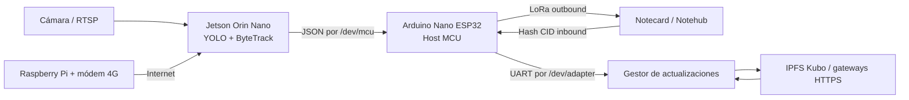

# PINV01-27 — Nodo autónomo de conteo vehicular

Repositorio reproducible para desplegar un nodo de monitoreo vehicular en **NVIDIA Jetson**, con detección y seguimiento mediante **Ultralytics YOLO**, comunicación con un **Host MCU Arduino Nano ESP32**, transmisión LoRa/Notehub y recepción de actualizaciones remotas mediante **IPFS Kubo**.

> El objetivo principal de este repositorio es documentar el **setup completo de la Jetson** y proporcionar una secuencia verificable de instalación, prueba e integración.

## Arquitectura



## Plataforma de referencia

La guía principal se preparó para la plataforma utilizada en el proyecto:

- NVIDIA Jetson Orin Nano 4 GB.
- JetPack 5.1.3 / Jetson Linux 35.5.0 / Ubuntu 20.04.
- Python 3.8 dentro de Miniconda.
- PyTorch para Jetson con CUDA, no el paquete genérico de PyPI.
- Kubo 0.42.0 para Linux ARM64.
- Arduino Nano ESP32 como Host MCU.

La matriz completa y los comandos de verificación están en [`docs/jetson/00-platform-matrix.md`](docs/jetson/00-platform-matrix.md).

## Orden recomendado de instalación

1. [Flashear JetPack](docs/jetson/01-flash-jetpack.md).
2. [Preparar el sistema base](docs/jetson/02-system-preparation.md).
3. [Instalar Miniconda](docs/jetson/03-miniconda.md).
4. [Instalar IPFS Kubo](docs/jetson/04-ipfs-kubo.md).
5. [Instalar PyTorch con CUDA](docs/jetson/05-pytorch-cuda.md).
6. [Instalar Ultralytics](docs/jetson/06-ultralytics.md).
7. [Verificar CUDA, Torch y YOLO](docs/jetson/07-verification.md).
8. [Configurar aliases udev `/dev/mcu` y `/dev/adapter`](docs/jetson/08-udev.md).
9. [Cargar el firmware del Host MCU](docs/arduino/firmware.md).
10. [Probar el envío Jetson → MCU → LoRa](docs/integration/uart-lora-test.md).
11. [Instalar y habilitar el servicio systemd](docs/jetson/09-systemd.md).
12. [Configurar la Raspberry Pi como router](docs/network/raspberry-router.md).

## Inicio rápido después del setup

```bash
conda activate yolo
python examples/verify_jetson_stack.py
python examples/generic_vehicle_counter.py --source 0 --show
```

Para la aplicación integrada:

```bash
export PINV_VIDEO_SOURCE='rtsp://usuario:contrasena@IP:554/ruta'
export PINV_MODEL_PATH="$PWD/models/yolo26n.pt"
python src/vehicle_counter/script.py
```

Para el gestor de actualizaciones IPFS:

```bash
python src/update_manager/node.py
```

## Estructura del repositorio

```text
.
├── docs/                       # Guías ordenadas de instalación e integración
├── environment/                # Dependencias y referencia del entorno
├── examples/                   # Pruebas independientes del hardware LoRa
├── firmware/host_mcu/          # Firmware del Arduino Nano ESP32
├── rules/                      # Plantillas udev
├── scripts/install/            # Instaladores y automatización controlada
├── scripts/diagnostics/        # Diagnóstico de Jetson, CUDA, USB e IPFS
├── src/update_manager/         # Recepción de CID y actualización IPFS
├── src/vehicle_counter/        # Conteo vehicular y envío UART
└── systemd/                    # Plantilla del servicio
```

## Seguridad antes de publicar

- No subir contraseñas RTSP, tokens, ProductUID privados, claves o archivos `.env`.
- El código original contenía una URL RTSP con credenciales; en esta versión fue reemplazada por `PINV_VIDEO_SOURCE`.
- `firmware/host_mcu/lora/config.h` está ignorado por Git. Crear el archivo desde `config.example.h`.
- Revisar [`docs/legal/licensing.md`](docs/legal/licensing.md) antes de publicar o usar el sistema comercialmente.

## Estado de reproducción

Cada etapa tiene una sección **“Criterio de éxito”**. No continuar con la siguiente etapa hasta que la anterior funcione. Para registrar una instalación exacta:

```bash
conda env export --no-builds > environment/environment-lock.yml
pip freeze > environment/pip-freeze.txt
```

Estos archivos pueden versionarse cuando correspondan a una instalación validada y sin información sensible.

## Router 4G

La Raspberry Pi que entrega internet a la Jetson se documenta en un repositorio separado. Agregar su URL en [`docs/network/raspberry-router.md`](docs/network/raspberry-router.md).

## Publicación en GitHub

Consultar [`docs/github-publishing.md`](docs/github-publishing.md).

## Créditos

Proyecto PINV01-27, Laboratorio de Sistemas Distribuidos, Facultad de Ingeniería de la Universidad Nacional de Asunción.
