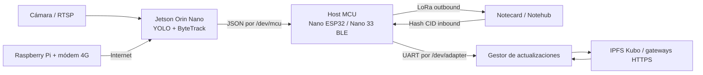

# PINV01-27 — Nodo autónomo de conteo vehicular

Repositorio reproducible para desplegar un nodo de monitoreo vehicular en **NVIDIA Jetson**, con detección y seguimiento mediante **Ultralytics YOLO**, comunicación con un **Host MCU Arduino Nano ESP32 o Arduino Nano 33 BLE**, transmisión LoRa/Notehub y recepción de actualizaciones remotas mediante **IPFS Kubo**.

> El objetivo principal de este repositorio es documentar el **setup completo de la Jetson** y proporcionar una secuencia verificable de instalación, prueba e integración.

## Arquitectura


```mermaid
flowchart LR
    CAM[Cámara / RTSP] --> JETSON[Jetson Orin Nano\nYOLO + ByteTrack]
    JETSON -->|JSON por /dev/mcu| MCU[Host MCU\nNano ESP32 / Nano 33 BLE]
    MCU -->|LoRa outbound| CLOUD[Notecard / Notehub]
    CLOUD -->|Hash CID inbound| MCU
    MCU -->|UART por /dev/adapter| UPDATER[Gestor de actualizaciones]
    UPDATER --> IPFS[IPFS Kubo / gateways HTTPS]
    IPFS --> UPDATER
    RPI[Raspberry Pi + módem 4G] -->|Internet| JETSON
```

## Plataforma de referencia

La guía principal se preparó para la plataforma utilizada en el proyecto:

- NVIDIA Jetson Orin Nano 4 GB.
- JetPack 5.1.3 / Jetson Linux 35.5.0 / Ubuntu 20.04.
- Python 3.8 dentro de Miniconda.
- PyTorch para Jetson con CUDA, no el paquete genérico de PyPI.
- Kubo 0.42.0 para Linux ARM64.
- Arduino Nano ESP32 o Arduino Nano 33 BLE como Host MCU.

La matriz completa y los comandos de verificación están en [`docs/jetson/00-platform-matrix.md`](docs/jetson/00-platform-matrix.md).

## Orden recomendado de instalación

1. [Flashear JetPack](docs/jetson/01-flash-jetpack.md).
2. [Preparar el sistema base](docs/jetson/02-system-preparation.md).
3. [Configurar la Raspberry Pi como router](docs/network/raspberry-router.md).
4. [Configurar OpenVPN en la Jetson](docs/jetson/10-openvpn.md).
5. [Instalar Miniconda](docs/jetson/03-miniconda.md).
6. [Instalar IPFS Kubo](docs/jetson/04-ipfs-kubo.md).
7. [Instalar PyTorch con CUDA](docs/jetson/05-pytorch-cuda.md).
8. [Instalar Ultralytics](docs/jetson/06-ultralytics.md).
9. [Verificar CUDA, Torch y YOLO](docs/jetson/07-verification.md).
10. [Configurar aliases udev `/dev/mcu` y `/dev/adapter`](docs/jetson/08-udev.md).
11. [Cargar el firmware del Host MCU](docs/arduino/firmware.md).
12. [Probar el envío Jetson → MCU → LoRa](docs/integration/uart-lora-test.md).
13. [Instalar y habilitar el servicio systemd](docs/jetson/09-systemd.md).


## Inicio rápido después del setup

```bash
conda activate yolo
python examples/verify_jetson_stack.py
python examples/generic_vehicle_counter.py --source 0 --show
```

Para la aplicación integrada:

```bash
export PINV_VIDEO_SOURCE='rtsp://usuario:contrasena@IP:554/ruta'
export PINV_MODEL_PATH="$PWD/models/yolo26n.pt"
python src/vehicle_counter/script.py
```

Para ejecutar manualmente el gestor de actualizaciones IPFS, seleccionar la variante correspondiente al Host MCU.

### Arduino Nano ESP32

```bash
python src/update_manager/nano_esp32/node.py
```

### Arduino Nano 33 BLE

```bash
python src/update_manager/nano_33_ble/node.py
```

## Actualizaciones remotas

El nodo permite actualizar remotamente:

- El código Python ejecutado en la Jetson.
- Los pesos del modelo YOLO.
- El firmware compilado del Host MCU.

Las actualizaciones se empaquetan como archivos `.tar` o `.tar.gz`, se distribuyen mediante IPFS y se identifican mediante su CID. El CID se transmite al nodo a través de LoRa y UART.

El archivo `.ino.bin` incluido en una actualización de firmware debe haber sido compilado específicamente para la variante de Host MCU instalada en el nodo.

El procedimiento completo para preparar, enviar y verificar una actualización está disponible en:

- [Procedimiento de actualización remota](docs/updates/procedimiento-de-actualizacion.md)

## Estructura del repositorio

```text
.
├── docs/
│   ├── arduino/
│   ├── integration/
│   ├── jetson/
│   ├── network/
│   └── updates/
├── environment/
├── examples/
├── firmware/
│   └── host_mcu/
│       ├── nano_esp32/
│       └── nano_33_ble/
├── rules/
├── scripts/
│   ├── install/
│   └── diagnostics/
├── src/
│   ├── update_manager/
│   │   ├── nano_esp32/
│   │   └── nano_33_ble/
│   └── vehicle_counter/
└── systemd/
```

## Seguridad antes de publicar

- No subir contraseñas RTSP, tokens, ProductUID privados, claves o archivos `.env`.
- El código original contenía una URL RTSP con credenciales; en esta versión fue reemplazada por `PINV_VIDEO_SOURCE`.
- Los archivos `firmware/host_mcu/*/lora/config.h` están ignorados por Git. Crear cada archivo desde el `config.example.h` correspondiente.
- No subir archivos `.ovpn`; pueden contener credenciales, certificados y claves privadas.
- No publicar paquetes de actualización que contengan credenciales o información privada.
- Revisar [`docs/legal/licensing.md`](docs/legal/licensing.md) antes de publicar o usar el sistema comercialmente.

## Estado de reproducción

Cada etapa tiene una sección **“Criterio de éxito”**. No continuar con la siguiente etapa hasta que la anterior funcione.

Para registrar una instalación exacta:

```bash
conda env export --no-builds > environment/environment-lock.yml
pip freeze > environment/pip-freeze.txt
```

Estos archivos pueden versionarse cuando correspondan a una instalación validada y no contengan información sensible.

## Diagnóstico rápido

```bash
python examples/verify_jetson_stack.py
sudo systemctl status pinv0127.service
journalctl -u pinv0127.service -n 100 --no-pager
```

## Router 4G

La Raspberry Pi que proporciona conectividad 4G a la Jetson se documenta en un repositorio independiente:

- [Raspberry Pi 4G Router](https://github.com/fpalacios09/raspberry-4g-router)

La integración de este repositorio con el nodo PINV01-27 se resume en:

- [Integración con Raspberry Pi Router](docs/network/raspberry-router.md)

## Publicación en GitHub

Consultar:

[`docs/github-publishing.md`](docs/github-publishing.md)

## Créditos

Proyecto **PINV01-27**, Laboratorio de Sistemas Distribuidos, Facultad de Ingeniería de la Universidad Nacional de Asunción.
